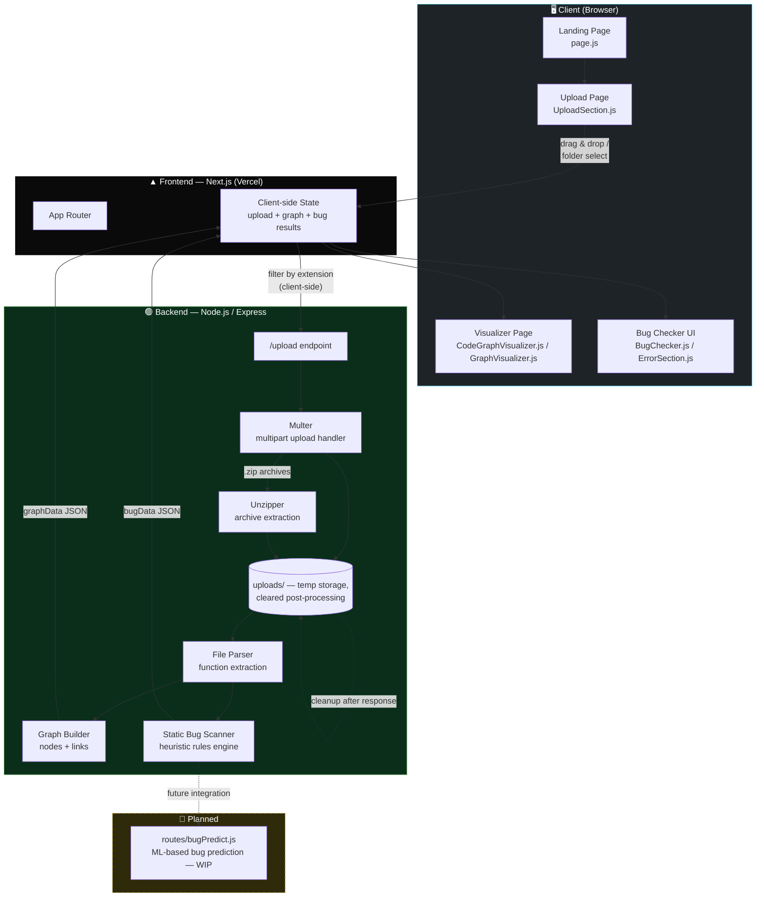
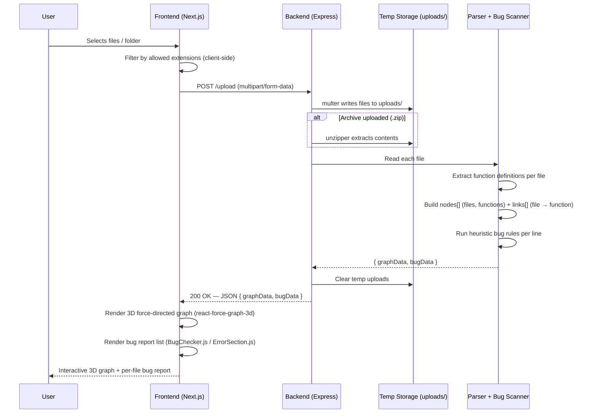

# 🔗 LinkTrace — 3D Flow Visualizer & Bug Explorer

> Upload your codebase and watch it come alive: an interactive 3D graph of files and the functions they define, paired with a lightweight static bug checker that flags common code smells before they bite you.

**TY Sem 5 — PBL Project**

[](https://link-trace-3-d-flow-visualizer-bug.vercel.app)


🌐 **Live App:** [link-trace-3-d-flow-visualizer-bug.vercel.app](https://link-trace-3-d-flow-visualizer-bug.vercel.app)

---

## 📖 Table of Contents

- [What is LinkTrace?](#-what-is-linktrace)
- [Why LinkTrace?](#-why-linktrace)
- [Features](#-features)
- [How It Works](#️-how-it-works)
- [System Architecture](#-system-architecture)
- [Tech Stack](#-tech-stack)
- [Project Structure](#️-project-structure)
- [Getting Started](#️-getting-started)
- [API Reference](#-api-reference)
- [Bug Detection Rules](#-bug-detection-rules)
- [Supported Languages](#-supported-file-types)
- [Limitations](#️-known-limitations)
- [Roadmap](#️-roadmap)
- [Contributing](#-contributing)
- [Author](#-author)
- [License](#-license)

---

## ✨ What is LinkTrace?

LinkTrace takes a set of source files — or a whole project folder — and turns their structure into something you can actually *see* and *rotate*, instead of just scrolling through folders.

It does three things under the hood:

1. **Parses** each uploaded file to extract the functions it defines (and, where detectable, the connections between files).
2. **Builds a graph** linking files to the functions inside them, so the codebase's shape becomes visible at a glance.
3. **Renders it in 3D** using a force-directed graph you can rotate, zoom, and explore — while simultaneously **scanning for common issues** (stray `console.log`s, leftover `TODO`s, suspicious imports, missing semicolons, overly long lines, etc.) and reporting them per file and line number.

It started as a learning project with a simple goal: make abstract codebase structure and code quality feel **tangible and explorable**, rather than something you only ever read as a wall of text in a terminal or linter output.

## 🤔 Why LinkTrace?

Most tools show you code quality as a list — a linter output, a terminal log, a static report. LinkTrace instead asks: *what if you could fly through your codebase like a 3D map?*

- New to a repo? Drop in the files and get an instant visual sense of how things connect.
- Reviewing a PR-sized set of files? Spot dense clusters of functions or oddly isolated files at a glance.
- Teaching or presenting? A rotating 3D graph communicates structure far faster than a directory tree.

## 🚀 Features

- 🌌 **3D force-directed graph** of files ↔ functions, powered by `react-force-graph-3d` and `three.js`
- 📁 **Drag-and-drop or folder upload**, with client-side filtering by file extension
- 🐞 **Static bug scanning** for `.js`, `.ts`, `.jsx`, `.tsx`, `.py`, `.java`, `.c`, and `.cpp` files
- 🎨 **Language-based color coding** in the graph for quick visual identification of file types
- 🖱️ **Interactive exploration** — rotate, zoom, and pan around the generated graph to inspect any node
- 🖥️ **Clean, animated landing page** built with Next.js + Tailwind CSS
- ⚡ **Fast, client-driven filtering** so large uploads only send relevant files to the backend

## ⚙️ How It Works

```
                ┌────────────────────┐
   Upload       │   Frontend (Next)  │
  files/folder  │  UploadSection.js  │
 ───────────────▶  filters by ext.   │
                └─────────┬──────────┘
                          │  multipart/form-data
                          ▼
                ┌────────────────────┐
                │  Backend (Express) │
                │     index.js       │
                │  1. multer upload  │
                │  2. parse files    │
                │  3. extract funcs  │
                │  4. build graph    │
                │  5. run bug scan   │
                └─────────┬──────────┘
                          │  { graphData, bugData }
                          ▼
                ┌────────────────────┐
                │  Frontend (Next)   │
                │ CodeGraphVisualizer│
                │  → 3D render       │
                │ BugChecker         │
                │  → error listing   │
                └────────────────────┘
```

1. **Upload** — Files (or an entire folder) are selected via `UploadSection.js`, filtered client-side by extension, and sent to the backend as a multipart form.
2. **Parse** — `backend/index.js` receives the files (via `multer`), reads each one, and extracts the functions it defines.
3. **Graph building** — Every file becomes a node; every function it defines becomes a child node linked back to its file, producing a `graphData` object of `nodes` and `links`.
4. **Bug scanning** — In the same pass, each file is run through a set of lightweight heuristic checks (see [Bug Detection Rules](#-bug-detection-rules) below), producing a `bugData` object keyed by file name.
5. **Visualize** — The frontend renders `graphData` as a rotatable, zoomable 3D graph (`CodeGraphVisualizer.js` / `GraphVisualizer.js`) color-coded by language, while `BugChecker.js` and `ErrorSection.js` display the flagged issues per file and line.

## 🏛 System Architecture

LinkTrace is a classic **decoupled client-server** application: a Next.js frontend (deployed on Vercel) that owns all UI/UX and 3D rendering, and an Express backend that owns file ingestion, parsing, and analysis. They communicate over a single stateless REST call. Nothing about the analysis is persisted server-side — each upload is processed in-memory/on-disk temporarily and discarded once a response is sent.

### High-Level Diagram



### Request Lifecycle (Sequence Diagram)



### Component Responsibilities

| Component | Layer | Responsibility |
|---|---|---|
| `page.js` | Frontend | Landing page, project intro, entry point |
| `UploadSection.js` | Frontend | Drag-and-drop/folder upload UI, client-side extension filtering, request orchestration |
| `visualizer/page.js` | Frontend | Hosts the 3D visualizer view |
| `CodeGraphVisualizer.js` | Frontend | Renders `graphData` as an interactive 3D force-directed graph (rotate/zoom/pan), applies language-based color coding |
| `GraphVisualizer.js` | Frontend | Wires raw API graph data into the shape the 3D renderer expects |
| `BugChecker.js` | Frontend | Displays bug-scan summary and drives the bug report UI |
| `ErrorSection.js` | Frontend | Renders the detailed per-file, per-line error/bug log |
| `about/page.js` | Frontend | Project/about information page |
| `backend/index.js` | Backend | Main server entry point — receives uploads, orchestrates parsing, graph building, and bug scanning, returns combined JSON |
| `multer` middleware | Backend | Handles multipart file uploads, writes to `backend/uploads/` |
| `unzipper` | Backend | Extracts `.zip` archive uploads into individual files before parsing |
| Parser (in `index.js`) | Backend | Reads each supported file and extracts function definitions |
| Graph Builder (in `index.js`) | Backend | Converts parsed functions into the `{ nodes, links }` graph structure |
| Bug Scanner (in `index.js`) | Backend | Runs heuristic rules (see [Bug Detection Rules](#-bug-detection-rules)) against each file's lines |
| `routes/bugPredict.js` | Backend (WIP) | Placeholder route intended for a future ML-based bug prediction service |
| `backend/uploads/` | Backend | Ephemeral file storage — files live here only for the duration of processing, then are cleared |

### Data Flow Summary

```
Browser              Next.js Frontend            Express Backend                 In-Memory/Temp Processing
───────              ─────────────────            ────────────────                 ──────────────────────
Select files  ──▶  Filter by extension  ──▶  POST /upload (multipart) ──▶  multer → uploads/
                                                                              │
                                                                              ▼
                                                                    Parse files → extract functions
                                                                              │
                                                        ┌─────────────────────┴─────────────────────┐
                                                        ▼                                             ▼
                                                Build graph (nodes/links)                 Run bug heuristics (per line)
                                                        │                                             │
                                                        └─────────────────────┬─────────────────────┘
                                                                              ▼
                                                          Respond: { graphData, bugData } (JSON)
                                                                              │
Render 3D graph  ◀──  Feed into CodeGraphVisualizer.js  ◀────────────────────┘
Render bug list  ◀──  Feed into BugChecker.js / ErrorSection.js
```

### Architectural Notes

- **Stateless backend:** No database is involved — every request is processed independently, and uploaded files are treated as ephemeral. This keeps the backend simple but means graphs/bug reports aren't currently persisted (see [Roadmap](#️-roadmap) for planned shareable-link support).
- **Client does the filtering, server does the heavy lifting:** Extension filtering happens client-side before upload to avoid sending irrelevant files, while all parsing, graph construction, and bug scanning happen server-side, keeping the frontend bundle light.
- **Single round-trip design:** Everything the UI needs — the graph structure *and* the bug report — comes back from one `POST /upload` call, so the frontend doesn't need to orchestrate multiple requests or handle partial states.
- **Extensible analysis pipeline:** Parsing, graph building, and bug scanning are conceptually separate steps within `index.js`, and `routes/bugPredict.js` is scaffolded as a future hook for swapping/augmenting the heuristic scanner with a real ML-based prediction model.
- **Decoupled deployment:** Frontend and backend are deployable independently (frontend demo runs on Vercel); the frontend points at the backend via `NEXT_PUBLIC_BACKEND_URL`, so the backend can be hosted anywhere without frontend code changes.

## 🧱 Tech Stack

| Layer | Technology |
|---|---|
| **Frontend** | Next.js (App Router), React 19, Tailwind CSS |
| **3D Rendering** | three.js, react-force-graph-3d, react-force-graph-2d, three-spritetext |
| **Backend** | Node.js, Express |
| **File Handling** | multer (uploads), unzipper (archive extraction) |
| **Tooling** | ESLint, Nodemon |
| **Deployment** | Vercel (frontend demo) |

## 🗂️ Project Structure

```
LinkTrace-3D-Flow-Visualizer-Bug-Explorer/
├── backend/
│   ├── index.js              # Main server: upload, parse, bug-check, respond with graph + bug data
│   ├── routes/
│   │   └── bugPredict.js     # (WIP) route for an ML-based bug prediction service
│   └── uploads/              # Temp storage for uploaded files (cleared after processing)
│
└── frontend/
    └── src/
        ├── app/
        │   ├── page.js            # Landing page
        │   ├── upload/page.js     # Upload flow
        │   ├── visualizer/page.js # 3D visualizer page
        │   └── about/page.js      # About page
        └── components/
            ├── UploadSection.js       # File/folder upload + orchestration
            ├── CodeGraphVisualizer.js # 3D graph rendering
            ├── GraphVisualizer.js     # Graph data wiring
            ├── BugChecker.js          # Bug-check UI + results
            └── ErrorSection.js        # Error/bug log display
```

## 🛠️ Getting Started

### Prerequisites

- Node.js v18+
- npm

### 1. Clone the repo

```bash
git clone https://github.com/Dhruvesh05/LinkTrace-3D-Flow-Visualizer-Bug-Explorer.git
cd LinkTrace-3D-Flow-Visualizer-Bug-Explorer
```

### 2. Set up the backend

```bash
cd backend
npm install
npm run dev   # starts with nodemon on http://localhost:5000
```

### 3. Set up the frontend

```bash
cd frontend
npm install
npm run dev   # starts Next.js on http://localhost:3000
```

By default, the frontend talks to `http://localhost:5000`. To point it elsewhere (e.g. a deployed backend), set:

```bash
# frontend/.env.local
NEXT_PUBLIC_BACKEND_URL=http://localhost:5000
```

### 4. Use it

Open `http://localhost:3000`, head to the upload section, drop in some source files (or a folder), and explore the generated 3D graph and bug report.

## 🔌 API Reference

### `POST /upload`

Accepts a multipart form with a `files` field (one or more files).

**Response:**

```json
{
  "graphData": {
    "nodes": [{ "id": "example.js", "functions": ["add", "subtract"] }],
    "links": [{ "source": "example.js", "target": "add" }]
  },
  "bugData": {
    "files": [
      {
        "name": "example.js",
        "errors": [
          { "line": 12, "column": 4, "message": "Unexpected console.log statement", "ruleId": "no-console" }
        ]
      }
    ]
  }
}
```

**Supported extensions:** `.js` `.ts` `.jsx` `.tsx` `.py` `.java` `.c` `.cpp`

## 🐛 Bug Detection Rules

LinkTrace runs a lightweight, heuristic-based static scan (not a full linter/AST analysis) that flags things like:

- Stray `console.log` / debug print statements left in code
- Leftover `TODO` / `FIXME` comments
- Suspicious or unused imports
- Missing semicolons (JS/TS)
- Overly long lines

Each flagged issue is reported with its file name, line number, column, a human-readable message, and a `ruleId`, mirroring the shape of familiar linter output so it's easy to scan.

> This is intentionally simple — it's meant to give a fast, visual first pass at code health, not replace ESLint, Pylint, or a proper static analyzer.

## 📄 Supported File Types

| Extension | Language |
|---|---|
| `.js` / `.jsx` | JavaScript / React |
| `.ts` / `.tsx` | TypeScript / React |
| `.py` | Python |
| `.java` | Java |
| `.c` | C |
| `.cpp` | C++ |

## ⚠️ Known Limitations

- Function/graph extraction relies on lightweight parsing rather than full language-aware ASTs, so highly dynamic or unconventional code patterns may not be captured perfectly.
- Currently graphs **file → function** relationships; cross-file **import/dependency** edges are on the roadmap (see below).
- Bug scanning is heuristic-based and intended for a quick first pass, not a replacement for a dedicated linter.
- Large uploads (very large folders) may take longer to parse and render smoothly in the 3D view.

## 🛣️ Roadmap

- [ ] Wire up `routes/bugPredict.js` to a real ML-based prediction service
- [ ] Support import/dependency edges between files (not just file → function)
- [ ] Persist and share visualizations via a shareable link
- [ ] Expand bug-detection rules beyond simple heuristics
- [ ] Full AST-based parsing for more accurate function/dependency extraction
- [ ] Support for additional languages (Go, Rust, etc.)

## 🤝 Contributing

Contributions, issues, and feature requests are welcome! Feel free to fork the repo, create a feature branch, and open a pull request.

```bash
# Fork, then:
git checkout -b feature/your-feature-name
git commit -m "Add your feature"
git push origin feature/your-feature-name
# Open a PR
```

## 👤 Author

**Dhruvesh** — [GitHub @Dhruvesh05](https://github.com/Dhruvesh05)

Built as a TY Sem 5 PBL (Project-Based Learning) project.

## 📜 License

This project is open source. Feel free to fork, modify, and build on it — consider adding an explicit [MIT License](https://choosealicense.com/licenses/mit/) file if you plan to formalize reuse terms.

---

⭐ If you find LinkTrace interesting, consider starring the repo!
